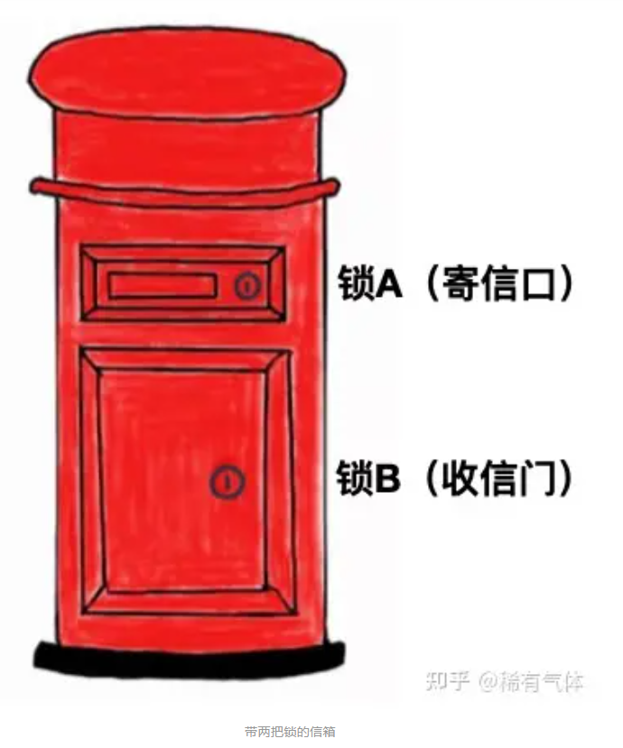

## 对称密钥的缺点

我们先看一个例子，小明和小红要进行通信，但是不想被其他人知道通信的内容，所以双方决定采用对称加密的方式。他们做了下面的事情：

1、双方商定了加密和解密的算法

2、双方确定密钥

3、通信过程中采用这个密钥进行加密和解密

这是不是一个看似完美的方案？但其中有一个步骤存在漏洞！

**问题出在步骤2：双方确定密钥！**

你肯定会问，双方不确定密钥，后面的加、解密怎么做？

问题在于确定下来的密钥如何让双方都知道。密钥在传递过程中也是可能被盗取的！这里引出了一个经典问题：**密钥配送问题。**

## 密钥配送问题

小明和小红在商定密钥的过程中肯定会多次沟通密钥是什么。即使单方一次确定下来，也要发给对方。加密是为了保证信息传输的安全，**但密钥本身也是信息**，密钥的传输安全又该如何保证呢？难不成还要为密钥的传输再做一次加密？这样不就陷入了死循环？

你是不是在想，密钥即使被盗取，不还有加密算法保证信息安全吗？如果你真的有这个想法，那么赶紧复习一下上一篇文章讲的**杜绝隐蔽式安全性**。任何算法最终都会被破译，所以不能依赖算法的复杂度来保证安全。

小明和小红现在左右为难，想加密就要给对方发密钥，但发密钥又不能保证密钥的安全。他们应该怎么办呢？

有如下几种解决密钥配送问题的方案：

1. 事先共享密钥
2. 密钥分配中心
3. Diffie-Hellman密钥交换
4. 非对称加密

本文就不展开讲每种方式，这里只是为了引出今天的主角——非对称加密。

## 非对称加密

非对称加密也称为公钥密码。我更愿意用非对称加密这种叫法。因为可以体现出加密和解密使用不同的密钥。

对称加密中，我们只需要一个密钥，通信双方同时持有。而非对称加密需要4个密钥。通信双方各自准备一对公钥和私钥。其中公钥是公开的，由信息接受方提供给信息发送方。公钥用来对信息加密。私钥由信息接受方保留，用来解密。既然公钥是公开的，就不存在保密问题。也就是说非对称加密完全不存在密钥配送问题！你看，是不是完美解决了密钥配送问题？

回到刚才的例子，小明和下红经过研究发现非对称加密能解决他们通信的安全问题，于是做了下面的事情：

1、小明确定了自己的私钥 mPrivateKey，公钥 mPublicKey。自己保留私钥，将公钥mPublicKey发给了小红

2、小红确定了自己的私钥 hPrivateKey，公钥 hPublicKey。自己保留私钥，将公钥 hPublicKey 发给了小明

3、小明发送信息 “周六早10点soho T1楼下见”，并且用小红的公钥 hPublicKey 进行加密。

4、小红收到信息后用自己的私钥 hPrivateKey 进行解密。然后回复 “收到，不要迟到” 并用小明的公钥mPublicKey加密。

5、小明收到信息后用自己的私钥 mPrivateKey 进行解密。读取信息后心里暗想：还提醒我不迟到？每次迟到的都是你吧？

以上过程是一次完整的request和response。通过这个例子我们梳理出一次信息传输的非对称加、解密过程：

1、消息**接收方**准备好公钥和私钥

2、私钥**接收方**自己留存、公钥发布给消息**发送方**

3、消息**发送方**使用接收方公钥对消息进行加密

4、消息**接收方**用自己的私钥对消息解密

**公钥只能用做数据加密。公钥加密的数据，只能用对应的私钥才能解密。这是非对称加密的核心概念**。

下面我用一个更为形象的例子来帮助大家理解。

我有下图这样一个信箱。

