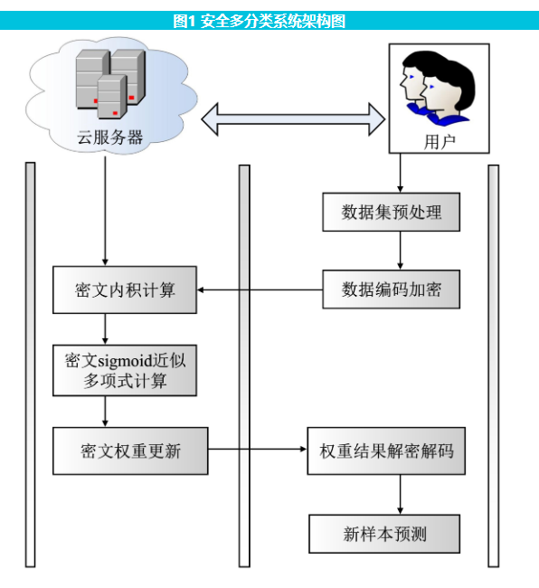

## 面向数据质量的隐私保护多分类LR方案

曹来成,, 吴文涛,, 冯涛,, 郭显,

兰州理工大学 计算机与通信学院,甘肃 兰州 730050

## Privacy preserving multi-classification LR scheme for data quality

CAO Laicheng,, WU Wentao,, FENG Tao,, GUO Xian,

School of Computer and Communication,Lanzhou University of Technology,Lanzhou 730050,China

**摘要**

为了保护机器学习中多分类逻辑回归模型的隐私,保证训练数据质量并减少计算和通信开销,提出了一种面向数据质量的隐私保护多分类逻辑回归方案。首先,基于近似数算术同态加密技术,利用批处理技术和单指令多数据机制将多条消息打包成一个密文,安全地将加密的向量移位成明文向量对应的密文。其次,采用“一对其余”的拆解策略,通过训练多个分类器,将二分类逻辑回归模型推广到多分类。最后,将训练数据集划分为多个固定大小的矩阵,这些矩阵仍然保留完整的样本信息数据结构;用固定的海森方法优化模型参数,使其适用于任何情况并保证参数隐私。在模型训练期间,该方案能够减轻数据的稀疏性,并保证数据质量。安全性分析显示,整个过程中能够保证训练模型和用户数据信息都不被泄漏,同时实验表明,该方案的训练准确率比现有方案有了较大提升,与未加密数据训练得到的准确率几乎相同,且该方案具有更低的计算开销。

**关键词：** 同态加密; 云计算; 逻辑回归; 隐私保护; 数据质量

**Abstract**

In order to protect the privacy of the multi-classification logistic regression model in machine learning,ensure the quality of training data,and reduce the computing and communication costs,a privacy preserving multi-classification logistic regressions cheme for data quality is proposed.First,based on the homomorphic encryption for arithmetic of approximate numbers technology,the batch processing technology and single-instruction multi-data mechanism are used to package multiple messages into one ciphertext,and the encrypted vector is safely shifted into the ciphertext corresponding to the plaintext vector.Second,the binary logistic regression model is extended to multiple classifications by training multiple classifiers using the "One vs Rest" disassembly strategy.Finally,the training data set is divided into several matrices of a fixed size,which still retain the complete data structure of the sample information.The fixed Hessian method is used to optimize the model parameters so that they can be used in any case and keep the parameters private.during model training.The scheme can reduce data sparsity and ensure data quality.The security analysis shows that the training model and user data information cannot be leaked in the whole process.Meanwhile,the experiment shows that the training accuracy of this scheme is greatly improved compared with the existing scheme and almost the same as that obtained by training unencrypted data,and that the scheme has a lower computing cost.

**Keywords：** homomorphic encryption; cloud computing; logical regression; privacy-preserving; data quality

## 引言

随着计算机计算能力的发展,机器学习技术在**推荐、认证、威胁分析**等服务中被广泛应用于生成预测模型。虽然该技术在语音、图像、文本等领域中都取得了重要的突破,也使得很多问题有了新的解决办法,但是它需要收集大量的用户数据,因此其安全和隐私问题不容小觑,如何保护数据的隐私已经成为了一个重要问题[[1](javascript:;)]。

保护数据隐私的**一种方法是在将数据上传到云中之前对数据进行加密**。在现今流行的云计算服务中,服务器和云服务提供商在用户结束服务很长时间后依旧可以访问用户数据,但云计算不能侵犯用户的数据隐私,这个挑战可以通过使用**同态加密方案**[[2](javascript:;)]来解决,**该方案允许在不解密的情况下对加密数据执行操作,而不会泄漏结果以外的任何信息,在密文域中进行计算,将计算后的结果解密就相当于在明文下直接计算**。同态加密技术可以对机器学习进行隐私保护,利用加密数据训练机器学习模型,将结果返回给用户自行解密,达到保护用户敏感信息的目的。

AHARONI等[[3](javascript:;)]提出了一个**基于同态加密的安全逻辑回归模型**,但这种解决方案**只能分析二分类问题**,而现实生活中存在许多分类问题[[4](javascript:;)]。SINHA等[[5](javascript:;)]使用**近似同态加密方案**(Cheon-Kim-Kim-Song,**CKKS**),以**位分片的形式应用量化和适当的数据打包,以减少噪声**;然而随着迭代次数的增加,CKKS方案的**参数也需要变大,这使得训练时间急剧增加**。JANG等[[6](javascript:;)]引入**扩展的CKKS方案**MatHEAAN(Matrix HEAAN),以**提供有效的矩阵表示和运算以及改进的噪声控制**;但是**随着样本数量的增加,可用操作的范围和网络的深度会受到限制**。YAN等[[7](javascript:;)]提出了一种**具有隐私保护特性的算法来解决多分类问题,将目标函数的梯度信息作为代理的隐私信息**;但是该算法在**训练期间没有考虑数据质量和数据稀疏问题**。JIA等[[8](javascript:;)]结合**可搜索加密和同态加密,使服务器可以通过盲查询陷门和索引执行密文数据搜索,使用搜索到的同态密文进行模型训练**;**但是在对于不同用户发送相同请求的冗余训练时,模型存储空间增大,耗时较长**。FU等[[9](javascript:;)]提出了一种**两方纵向联邦逻辑回归协议**,该协议通过**同态加密技术来保证特征数据和标签信息的安全**,虽然可以**保证模型无损,但是没有对非线性函数使用多项式近似计算,且没有考虑模型参数隐私**。ZHAO等[[10](javascript:;)]构建了一个**逻辑回归模型,将数据聚合矩阵构建算法和对称同态加密技术相结合**,在整个训练过程中**保护局部训练数据和全局模型免受推理攻击**。虽然云服务提供商和参与者之间不需要交互,减少了模型训练开销,但是最终**不能确定模型的性能是否满足逻辑回归分类要求**。EDEMACU等[[11](javascript:;)]提出了一个**具有低质量数据过滤的多方隐私保护逻辑回归框架,在分布式环境中提出一种度量梯度相似性,用于从具有较差质量数据的数据贡献者中过滤出参数;但是该梯度下降方法和求解逻辑回归模型参数方法不适用于特殊情况,例如数据集是高维稀疏矩阵**。

为解决上述问题,文中设计了一个在**保证数据质量的情况下用户数据隐私和模型参数隐私保护多分类逻辑回归**(Privacy Preserving Multi-classification Logistic Regression,**PPMLR**)方案,允许云服务提供商与参与者之间交互,使得模型的性能满足逻辑回归分类要求。**利用同态加密中的批处理技术和单指令多数据(Single Instruction Multiple Data,SIMD)机制,将多条消息打包成一个密文,并在多个明文时隙上执行相同的算术计算,减少所需的存储空间并优化计算时间。**

## 方案架构

稳私保护多分类逻辑回归方案主要分为4个部分,即预处理阶段、数据加密阶段、模型训练阶段和模型返回阶段,系统架构图如下。

## 结束语

文中提出了一种在加密的训练数据上实现多分类逻辑回归的方案,使数据所有者能够利用云服务提供商的强大存储和计算资源进行多分类逻辑回归分析,而不暴露训练数据的隐私,利用同态加密中的批处理技术和单指令多数据机制来加快训练进度;同时该方案能够保证训练数据的质量,在不影响多分类数据准确率的同时降低了计算开销。通过性能分析和实验对比,在真实数据集上进行模拟,该方案综合性能较好。